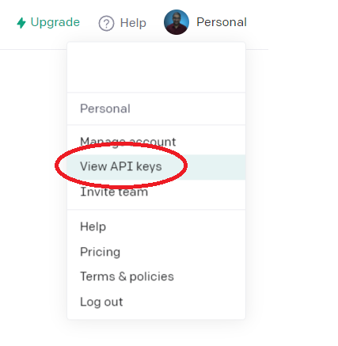
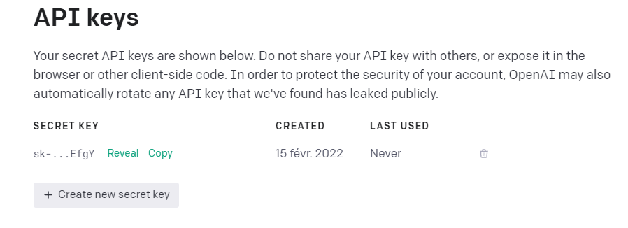
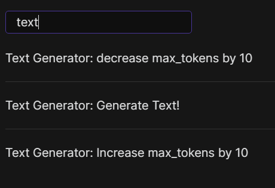

# Obsidian text generator Plugin 

Text generator is a handy plugin for [Obsidian](https://obsidian.md) that helps you generate text content using the powerful language model GPT-3.   

To use Text generator: you need to create an account at OpenAI to get an API Key and configure the plugin's setting to use API Key. 

# Get Open AI API Key
To generate Open AI API Key.  Follow  the following steps: 

1.  Create an account on [OpenAI](https://beta.openai.com/signup) (you will get a free 18$ trial account). 
2.  Click on your Account and click on View API keys

3.  Generate the API key that Text Generator Plugin will use

# Configure Text Generator plugin
After installing the "Text generator plugin" and enabling it, you need to provide the generated API Key to the plugin. 

# Text generator Plugin

In-Text generator Plugin, there are three commands that I recommend you to set hotkeys for: "Generate text," "Increase max_tokens by 10", and "decrease max_tokens by 10".

## Generate text
Select a text and run the command "Generate Text!"; it will generate a text with a max size of (**max_tokens**) using GPT-3 and insert it on the current cursor position.  You will see in the status bar **"Text generator (max_tokens): processing..."** while generating the text. 

> Open AI API considers both Input and output tokens in their cost calculation [Open AI pricing] (https://openai.com/api/pricing/).

## Control max_tokens
By setting hotkey for both commands, "Increase max_tokens by 10" and "decrease max_tokens by 10," you can easily control the size of the generated text.  The actual  max_tokens appears in the status bar **'Text generator (max_tokens):"** .

> To set a hotkey for a command, go to the "Settings" menu, then select the "Hotkeys" tab.  You will see a list of all the available commands, along with the associated hotkey.  Click on the desired command, then press the key combination you would like to use.  Make sure that another application does not already use the key combination.

# Interact with GPT-3 

There are several paid text editors based on GPT-3.  You can, for example, search on YouTube about videos about on these editors and use the same commands directly on GPT-3 using Text Generator Plugin. 

One of the most famous paid tools in the market is [Jasper](https://jasper.ai?special=qHt_szZ).  In Jasper, there are pre-built workflows known as **Recipes** that contain a series of Jasper (text editor based on GPT-3) commands to help you create content with Jasper using a repeatable process.  You can use the same commands to generate the content that you want! 
